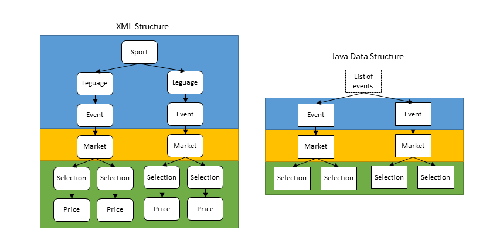

# NGen XML Parser

## Introduction

The NGen XML Parser is a generic XML parser engineered for n-to-m mapping from XML(s) to Java Object(s). It is designed to efficiently map different XML's with different schema from different data sources to a common Java data model. It is based upon a StAX parser library and it requires Java 8 or greater. It is particularly competitive during the following preconditions.

* The XML file structure does not map one-to-one to the desirable Java object model.
* The XML file contains more data than needed.
* The XML can be parsed as a stream and random access to elements are not needed.
* _n_-to-_m_-mapping, each XML files affects _m_ Java Objects, and each Java Object are affected by _n_ XML files

The NGen XML Parser is built up of three major components that needs to be understood by a user.

1.  The engine itself parses the XML in a StAX manner. It is configured by one setup structure for each XML tag that shall be parsable. The settings structures are thus per XML tag and not per Java object.
    Each XML tag does not have to be parsed into a specific Java object. Text content and attributes can be mapped to values in several different Java objects (or being discarded).
2.  The Settings structure settles five properties. The Settings structure is further described in the javadoc of the NGen XML Parser.
    1.  The **Name** of the element that it's meant to process
    2.  A callback named **Start Processor** that is invoked each time a start tag of this element is found. This will typically create one or several java objects that's needed to store the information from this element.
    3.  A list of **Attribute Mappers** that each maps one or several attributes to a java typed value and then sets it to a java object.
    4.  A list of **Text Content Mappers** that each maps the text content of the element to a java type and sets it to a java object.
    5.  A callback named **End Processor** that is invoked each time an end tag is found. This will typically add a created java object to a list in another java object.
3. The Object Branch is a representation of one branch in a tree of java objects. This object branch is where the end result is built up. If Class A contains a list of objects from class B, and B contains a list of C, the object branch will contains one object of typa A, one of type B and one of type C. These objects are the working-branch in the tree. Although not mapped one-to-one, this tree will most probably grow and shrink as the XML tree is traversed.</span>

The Object Branch reference is also available in javadoc, but it may need a bit more conceptual description for a first-time-user. This is elaborated in the rest of this document.

The Object Branch is simply a map of unique objects. It is not possible for two objects derived from the same class to exist in the object branch at the same time. There are no relationship between the objects in the object branch as one can expect a branch to have. But this is not needed since it is supposed to constantly represent only the present branch. If a new Java Object is created as the result of an XML start tag, it is pushed to the object branch. When the XML end tag is processed, the object is removed from the object branch since it's now "out of scope".

When doing a _1_-to-_m_ parsing, one document parser may push several result objects to the Object Branch. these result Objects **are not connected** and thus not part of a common tree, but totally independent. After the parsing is done, all objects pushed to the Object Branch are available as a part of the result using the documentParser.getResult(CLASS) API invocation.


## NGen XML Parser Code Examples

### Content
 - [Java Usage Example 1](#javaexample1) describes the usage of the XML parser for a _1-to-1_ mapping.
 - [Java Usage Example 2](#javaexample2) describes the usage of the XML parser for a _1-to-m_ mapping.
 - [Java Usage Example 3](#javaexample3) describes the usage of the XML parser for a _n-to-1_ mapping.
 - [Action Sequence 1](#actionsequence1) describes in text a mapping from one XML file to several JAVA objects.
 - [Example 1](#example1) describes a direct mapping from an XML to a JAVA object structure that reflects the XML.
 - [Example 2](#example2) describes a mapping from an XML file to a JAVA object structure, where the XML structure contain outer elements with information that shall be duplicated in Java objects further down the logical tree.
 - [Example 3](#example3) describes a mapping from an XML file to a JAVA object structure, where the XML structure contain inner elements with information that shall be available in a list of primitives in Java objects on an upper level of the logical tree.
 - [Example 4](#example4) describes a mapping from two XML files to a single JAVA object structure.


<a name="javaexample1"></a>
### Java Usage Example 1

This example maps a single XML to a Java object. We assume that a few methods and classes are available:
```java
 - getCallUrl(eventId) // URL where to fetch the XML files.
 - XmlMappings() // creates a new mapping class (com.mobenga.ngen.xml.parser.Mappings) for the XML.
```

```java
    public Event mapData(String eventId) {

        // Setup the parser for the expected data - Event data
        DocumentParser documentParser = new DocumentParser(new XmlMappings());

        // Parse data
        return xmlDataFetcher.fetchAndParseXml(getCallUrl(eventId), documentParser, Event.class);
    }
```

<a name="javaexample2"></a>
### Java Usage Example 2

This example maps a single XML to a two different Java objects. We assume that a few methods and classes are available:
```java
 - getCallUrl(eventId) // URL where to fetch the first XML files.
 - XmlMappings() // creates a new mapping class (com.mobenga.ngen.xml.parser.Mappings) for the XML.
```

```java
public Object[] mapData(String eventId) {
    // Setup the parser for the expected data - Event data
    DocumentParser documentParser = new DocumentParser(new XmlMappings());

    // Parse data
    xmlDataFetcher.fetchAndParseXml(getCallUrl(eventId), documentParser, null);

    MyDataClassOne myDataClassOne = documentParser.getResult(MyDataClassOne.class);
    MyDataClassTwo myDataClassTwo = documentParser.getResult(MyDataClassTwo.class);

    return new Object[]{myDataClassOne, myDataClassTwo};
}
```

<a name="javaexample3"></a>
### Java Usage Example 3

This example maps two different XMLs to a common Java object. The Two different XMLs are not available at the same time (result of two different API calls) and stored in between the calls. We assume that a few methods and classes are available:
```java
 - getCurrentDataForEventOrCreateNewObject(id) // get the previously parsed data or a new data object if no previous data is available.
 - getCallOneUrl(eventId) // URL where to fetch the first XML files.
 - getCallOneUrl(eventId) // URL where to fetch the second XML files.
 - XmlOneMappings() // creates a new mapping class (com.mobenga.ngen.xml.parser.Mappings) for the first XML.
 - XmlTwoMappings() // creates a new mapping class (com.mobenga.ngen.xml.parser.Mappings) for the second XML.
```

```java
    public Event mapData1(String eventId) {
        // Get current Event Data Component and add data from this Content API call
        Event event = getCurrentDataForEventOrCreateNewObject(id);

        // Provide current Event data to the XML Parser
        ProtectedClassMap objectBranch = new ProtectedClassMap(Event.class, event);

        // Setup the parser for the expected data - Event data
        DocumentParser documentParser = new DocumentParser(new XmlOneMappings(), objectBranch);

        // Parse data
        return xmlDataFetcher.fetchAndParseXml(getCallOneUrl(eventId), documentParser, Event.class);
    }

    public Event mapData2(String eventId) {
        // Get current Event Data Component and add data from this Content API call
        Event event = getCurrentDataForEventOrCreateNewObject(id);

        // Provide current Event data to the XML Parser
        ProtectedClassMap objectBranch = new ProtectedClassMap(Event.class, event);

        // Setup the parser for the expected data - Event data
        DocumentParser documentParser = new DocumentParser(new XmlTwoMappings(), objectBranch);

        // Parse data
        return xmlDataFetcher.fetchAndParseXml(getCallTwoUrl(eventId), documentParser, Event.class);
    }
}
```

<a name="actionsequence1"></a>
### Action Sequence 1

In this example the following XML will be parsed

    <sport name="Football">
     <leguage name="Premier League">
      <event id="1" name ="LEICESTER - NORWICH">
       <market id="1" name="Total Goals - Over/Under 2.5">
        <selection id="1" name="over">
         <price value=1.72/>
        </selection>
        <selection id="1" name="under">
         <price value=2.00/>
        </selection>
       </market>
      </event>
     </leguage>
     <leguage name="Champions League">
      <event id="2" name ="ARSENAL - BARCELONA">
       <market id="1" name="Total Goals - Over/Under 2.5">
        <selection id="1" name="over">
         <price value=1.61/>
        </selection>
        <selection id="1" name="under">
         <price value=2.20/>
        </selection>
       </market>
      </event>
     </leguage>
    </sport>

The desired result is a list over all events where the information about sport and league is stored in each event (in the Java data structure). Also, the Java structure does not have individual objects for price, but this information is stored in the selection object.

The table below describes a typical XML structure (in the left column) that is built into a Java data structure in form of a tree. The Java data structure and the XML structure is shown in the image below. In the table below the image, each row in the table describes a single step in the XML parsing process. Walk through the table to follow the process step by step as the StAX parser works itself tag by tag in the XML. (More elaborate examples including source code is available in Example 2-5 below.)



XML tag | Action | New Java Object | Object Branch
--- | --- | --- | ---
&lt;sport&gt; | Sport name is extracted. A new proprietary Java object for data storage is created and the sport name is stored there. The data storage object is pushed to the object branch. Also an ArrayList with Events is created and pushed to the object branch and this object is the expected end result of the parsing | DataStorage<br/>ArrayList&lt;Event&gt;&nbsp; | DataStorage<br/>ArrayList&lt;Event&gt;&nbsp;
&lt;league&gt; | League name is extracted. The data storage object from the object branch is fetched and the league name is stored there. | - | DataStorage<br/>ArrayList&lt;Event&gt;&nbsp;
&lt;event&gt; | Event information is extracted. This will be mapped to a Java object called Event. The ArrayList object is fetched from the object branch and the Event is added to this list. The data storage object is also fetched from the object branch and the sports and league names are read and stored in the Event object. The Event object is pushed to the object branch. | Event | DataStorage<br/>ArrayList&lt;Event&gt;<br/>Event
&lt;market&gt; | Market Information is extracted. A new java object of type Market is instantiated and the information is stored there. The Event object is fetched from the object branch and the market object is added to a list of markets for the event. The market object is pushed to the object branch. | Market | DataStorage<br/>ArrayList&lt;Event&gt;<br/>Event<br/>Market
&lt;selection&gt; | Selection Information is extracted. A new java object of type Selection is instantiated and the information is stored there. The Market object is fetched from the object branch and the selection object is added to a list of selections for the market. The selection object is pushed to the object branch. | Selection | DataStorage<br/>ArrayList&lt;Event&gt;<br/>Event<br/>Market<br/>Selection&nbsp;
&lt;price/&gt; | Price Information is extracted. No new java object is created The Selection object is fetched from the object branch and the price information is directly mapped to the selection object. | - | same...
&lt;/selection&gt; | Remove Selection object from object branch | - | DataStorage<br/>ArrayList&lt;Event&gt;<br/>Event<br/>Market
&lt;selection&gt; | Selection Information is extracted for the second selection. A new java object of type Selection is instantiated and the information is stored there. The Market object is fetched from the object branch and the selection object is added to a list of selections for the market. The selection object is pushed to the object branch. | Selection | DataStorage<br/>ArrayList&lt;Event&gt;<br/>Event<br/>Market<br/>Selection (no 2)
&lt;price/&gt; | Price Information is extracted. No new java object is created The Selection object is fetched from the object branch and the price information is directly mapped to the selection object. It is now the second selection object in the markets selection list that is present on the object branch. | - | same...
&lt;/selection&gt; | Remove Selection object from object branch | - | DataStorage<br/>ArrayList&lt;Event&gt;<br/>Event<br/>Market
&lt;/market&gt; | Remove Market object from the object branch | - | DataStorage<br/>ArrayList&lt;Event&gt;<br/>Event
&lt;/event&gt; | Remove Event object from the object branch | - | DataStorage<br/>ArrayList&lt;Event&gt;
&lt;/league&gt; | Fetch the data storage object from the object branch and set the league name to null since it's now no longer valid in the XML scope. | - | DataStorage<br/>ArrayList&lt;Event&gt;
&lt;/sport&gt; | Remove DataStorage object from the object branch. | - | ArrayList&lt;Event&gt;

<a name="example1"></a>
### Example 1

In this example the following XML will be parsed

    <event id="1" name ="Foo">
     Main Market Name
     <market id="1" name="Mkt Foo">
     </market>
     <market id="2" name="Mkt Bar">
     </market>
    </event>

The result is a java object structure that is one event with a list of two markets.The table below is the flow when parsing the XML

 XML Line | NGen XML Parser Event | Java Object Event | Object Branch Content After Operation
 --- | --- | --- | ---
&lt;event id="1" name ="Foo"&gt; | Start Processor | new Event() | Event.class (the new event)
 -"- | Attribute Mappings | get event from obj branch<br>event.setId("1")<br>event.setName("Foo") | Event.class
 Main Market Name | Element Text Mappings | event.setMainMarket("Main Market Name") | Event.class
&lt;market id="1" name="Mkt Foo"&gt; | Start Processor | new Market() | Event.class <br/> Market.class (the new market)
 -"- | Attribute Mappings | market.setId("1")<br>market.setName("Mkt Foo") | Event.classMarket.class
&lt;/market&gt; | End Processor | get event from obj branch<br>pop market from obj branch<br>event.getMarkets.add(market) | Event.class
&lt;market id="2" name="Mkt Bar"&gt; | Start Processor | new Market() | Event.class <br/> Market.class (the new market)
 -"- | Attribute Mappings | market.setId("2") <br/> market.setName("Mkt Bar") | Event.class <br/> Market.class
&lt;/market&gt; | End Processor | get event from obj branch <br/> pop market from obj branch <br/> event.getMarkets.add(market) | Event.class
&lt;/event&gt; | End Processor | Do nothing | Event.class

Finally, below is a link to the setting done in JAVA to instruct the flow described above. See file [EventMapperExample1.java](./src/test/java/com/mobenga/ngen/xml/parser/example/EventMapperExample1.java)

Here is a [unit test that executes the code.](./src/test/java/com/mobenga/ngen/xml/parser/example)

<a name="example2"></a>
### Example 2

In this example the following XML will be parsed

    <sport name="Football">
     <event id="1" name ="Foo">
      <market id="1" name="Mkt Foo">
      </market>
     </event>
    </sport>

The result is a java object structure that is one event that contains the sport name with a list of one market. The table below is the flow when parsing the XML. The sport name is temporarily stored in an object called ProprietaryDataStorage

XML Line | NGen XML Parser Event | Java Object Event | Object Branch Content After Operation
--- | --- | --- | ---
&lt;sport name="Football&gt; | Start Processor | new ProprietaryDataStorage() | ProprietaryDataStorage().class
-"- | Attribute Mappings | Get data storage from obj branch <br/> myDataStorage.setSport(); | ProprietaryDataStorage().class
&lt;event id="1" name ="Foo"&gt; | Start Processor | Get data storage from obj branch: <br/> new Event() <br/> event.setSport(myDataStorage.getSport()) | ProprietaryDataStorage().class <br/> Event.class (the new event)
-"- | Attribute Mappings | Get event from obj branch <br/> event.setId("1") <br/> event.setName("Foo") | ProprietaryDataStorage().class <br/> Event.class
-"- | &lt;market id="1" name="Mkt Foo"&gt; | Start Processor | new Market() | ProprietaryDataStorage().class <br/> Event.class <br/> Market.class (the new market)
-"- | Attribute Mappings | market.setId("1") <br/> market.setName("Mkt Foo") | ProprietaryDataStorage().class <br/> Event.class <br/> Market.class
&lt;/market&gt; | End Processor | Get event from obj branch <br/> Pop market from obj branch <br/> event.getMarkets.add(market) | ProprietaryDataStorage().class <br/> Event.class
&lt;/event&gt; | End Processor | Do nothing | ProprietaryDataStorage().class <br/> Event.class
&lt;/sport&gt; | End Processor | pop dataStorage from obj branch | Event.class

Finally, below is the link to the setting done in JAVA to instruct the flow described above, see
[EventMapperExample2.java](./src/test/java/com/mobenga/ngen/xml/parser/example/EventMapperExample2.java)

Here is a [unit test that executes the code.](./src/test/java/com/mobenga/ngen/xml/parser/example)

<a name="example3"></a>
### Example 3

In this example the following XML will be parsed. Selections will not be represented by objects in the Market object, but just as a list of names.

    <event id="1" name ="Foo">
     <market id="1" name="Mkt Foo">
      <selection id="1" name="Sel Foo">
       <price odds_frac="1/3" odds_dec="1.33"/>
      </selection>
     </market>
    </event>

The result is a java object structure that is one event with a list of two markets. The table below is the flow when parsing the XML

XML Line | NGen XML Parser Event | Java Object Event | Object Branch Content After Operation
--- | --- | --- | ---
&lt;event id="1" name ="Foo"&gt; | Start Processor | Get data storage from obj branch <br/> new Event() <br/> event.setSport(myDataStorage.getSport()) | Event.class (the new event)
-"- | Attribute Mappings | Get event from obj branch <br/> event.setId("1") <br/> event.setName("Foo") | Event.class
&lt;market id="1", name="Mkt Foo"&gt; | Start Processor | new Market() | Event.class <br/> Market.class (the new market)
-"- | Attribute Mappings | market.setId("1") <br/> market.setName("Mkt Foo") | Event.class <br/> Market.class
&lt;selection id="1" name="Sel Foo"/&gt; | Start Processor | Do nothing | Event.class <br/> Market.class
-"- | Attribute Mappings | market.addSelection("Sel Foo") | Event.class <br/> Market.class
-"- | End Processor | Do nothing | Event.class <br/> Market.class |
&lt;selection id="1" name="Sel Bar"/&gt; | Start Processor | Do nothing | Event.class <br/> Market.class
-"- | Attribute Mappings | market.addSelection("Sel Bar") | Event.class <br/> Market.class
-"- | End Processor | Do nothing | Event.class <br/> Market.class
&lt;/market&gt; | End Processor | Get event from obj branch <br/> Pop market from obj branch <br/> event.getMarkets.add(market) | Event.class
&lt;/event&gt; | End Processor | Do nothing | Event.class

Finally, below is the link to the setting done in JAVA to instruct the flow described above, see
[EventMapperExample3.java](./src/test/java/com/mobenga/ngen/xml/parser/example/EventMapperExample3.java)

Here is a [unit test that executes the code.](./src/test/java/com/mobenga/ngen/xml/parser/example)

<a name="example4"></a>
### Example 4

Describes a mapping from two XML files to a single JAVA object structure. In this example the following two XML files will be parsed. The second XML contains more information that shall be added to a specific market.

    <event id="1" name ="Foo">
     Main Market Name
     <market id="1" name="Mkt Foo">
     </market>
     <market id="2" name="Mkt Bar">
     </market>
    </event>

    <event id="1">
     <market id=\"1\">
      <selection id=\"1\" name=\"Sel Foo\" price=\"7/5\"/>
      <selection id=\"2\" name=\"Sel Bar\" price=\"5/3\"/>
      <selection id=\"3\" name=\"Sel Mitzvah\" price=\"3/1\"/>
     </market>
    </event>

The first XML is parsed according to [Example 1](#example1).

When the second document parser is instantiated, it is not only setup with the parser settings for the second XML. It is also setup with the output data from the first parser. This imitates a second API call to extend the existing data.
Old data is injected by pre populating an Object Branch and then use that Object Branch in the second parsing. The setup in JAVA is shown below in method testEventMapperExample4 of EventMapperExampleTest.java in [Github](./src/test/java/com/mobenga/ngen/xml/parser/example).

The result is a java object structure that is one event with a list of two markets. The table below is the flow when parsing the XML. Note that the Start Processor is used. The Start Processor is a callback that is invoked each time a start tag for this XML element is found, see javadoc for ElementParserSettings#setElementStartProcessor.

 XML Line | NGen XML Parser Event | Java Object Event | Object Branch Content After Operation
  --- | --- | --- | ---
 &lt;event id="1"&gt; | Start Processor | Do Nothing | Event.class (the old event)
-"- | Attribute Mappings | Do Nothing | Event.class
&lt;market id="1"&gt; | Start Processor(Market, id) | Get event from obj branch <br/> Search market in event by ID <br/> Push found market to obj branch | Event.class <br/> Market.class (the found market)
-"- | Attribute Mapper | Do Nothing | Event.class <br/> Market.class
&lt;selection id="1" name="Sel Foo" price="7/5"/&gt; | Start Processor | Create an Selection object <br/> Push Selection object to object branch | Event.class <br/> Market.class <br/> Selection.class
-"- | Attribute Mappings | Map attributes to Selection Object | Event.class <br/> Market.class <br/> Selection.class
-"- | End Processor | Add Selection object to Market <br/> Pop Selection object from Object Branch. | Event.class <br/> Market.class
&lt;selection id="2" name="Sel Bar" price="5/3"/&gt; | Start Processor | Create an Selection object <br/> Push Selection object to object branch | Event.class <br/> Market.class <br/> Selection.class
-"- | Attribute Mappings | Map attributes to Selection Object | Event.class <br/> Market.class <br/> Selection.class
-"- | End Processor | Add Selection object to Market <br/> Pop Selection object from Object Branch. | Event.class <br/> Market.class
&lt;selection id="3" name="Sel Mitzvah" price="3/1"/&gt; | Start Processor | Create an Selection object <br/> Push Selection object to object branch | Event.class <br/> Market.class <br/> Selection.class
-"- | Attribute Mappings | Map attributes to Selection Object | Event.class <br/> Market.class <br/> Selection.class
-"- | End Processor | Add Selection object to Market <br/> Pop Selection object from Object Branch. | Event.class <br/> Market.class
&lt;/market&gt; | End Processor | Pop market from obj branch | Event.class
&lt;/event&gt; | End Processor | Do nothing | Event.class

Finally, below is the link to the setting done in JAVA to instruct the flow described above, see
[EventMapperExample4.java](./src/test/java/com/mobenga/ngen/xml/parser/example/EventMapperExample4.java)

Here is a [unit test that executes the code.](./src/test/java/com/mobenga/ngen/xml/parser/example)
